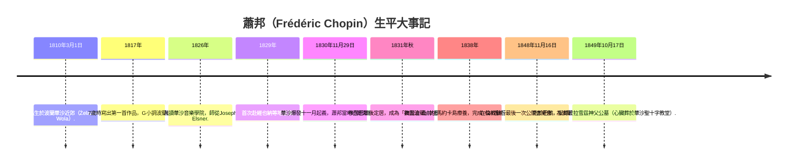
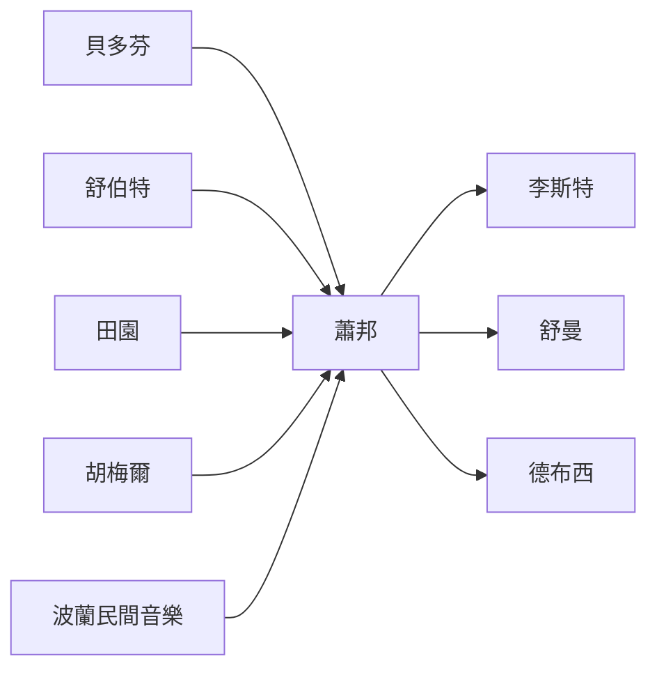

# 執行摘要

蕭邦（Frédéric Chopin，1810–1849）為浪漫主義時期最重要的鋼琴家和作曲家之一，以鋼琴獨奏作品聞名於世。他出生於波蘭華沙近郊的Żelazowa Wola，自幼展現音樂天賦，青春期在華沙音樂學院師從約瑟夫·艾爾斯納（Joseph Elsner）。1830年波蘭十一月起義爆發之際，蕭邦剛結束中歐巡演，最終定居巴黎。他的音樂語言結合了抒情的旋律線（受義大利抒情歌劇影響）、豐富多變的和聲、靈活的節奏與速度、精巧的踏板技巧，以及深刻的情感表達。蕭邦的作品多以小品形式展現個人風格，如夜曲、舞曲、前奏曲、練習曲和幻想曲等，其中 mazurka（波蘭民間舞曲）與 polonaise（波蘭國舞）尤富民族色彩。他在巴黎貴族與沙龍文化中備受推崇，並深受貝多芬、田園（John Field）、胡梅爾等前輩以及波蘭民歌影響。蕭邦一生主要作品集中於鋼琴音樂，但其創新與藝術追求影響深遠，後世作曲家與鋼琴家（如李斯特、舒曼、德布西等）無不推崇仰慕。

## 個人生平與大事年表

以下時間表列舉蕭邦生平重要事件，部分資料來源如下表所示：

| 年份 | 事件 |
| --- | --- |
| **1810年3月1日** | 生於波蘭華沙附近Żelazowa Wola（當時華沙公國領土）。父為法裔教師、母為波蘭音樂家。 |
| **1817年** | 7歲時創作第一首獨立作品，一首G小調波蘭舞曲（由波蘭大公訂購出版）。 |
| **1826年** | 入讀華沙音樂學院，師從Joseph Elsner，學習嚴謹的曲式與和聲。 |
| **1829年** | 首次赴中歐巡演，1830年曾在布雷斯勞、德累斯頓、布拉格演出，1831年春到維也納演奏。 |
| **1830年11月29日** | 華沙爆發十一月起義。蕭邦當時已離開波蘭旅行，並在維也納舉辦音樂會。 |
| **1831年秋** | 抵達巴黎並定居，成為流亡波蘭的藝術象徵。巴黎為浪漫主義音樂中心，蕭邦亦開始在巴黎貴族圈舉辦私人演奏會。 |
| **1838年** | 與小說家喬治·桑（Aurore Dudevant）前往馬約卡島療養，創作完成《24首前奏曲》Op.28。 |
| **1848年11月16日** | 在倫敦舉行最後一次公開演出，並為波蘭難民舉辦慈善音樂會。當時歐洲爆發1848年革命浪潮，蕭邦展現對波蘭民族的關懷。 |
| **1849年10月17日** | 因肺結核病逝於巴黎。遺體安葬於巴黎拉雪茲神父公墓（其心臟依遺願留葬於華沙聖十字教堂）。 |

## 音樂風格與創作特徵

蕭邦的作品風格高度個人化，廣泛吸納歌唱抒情、和聲創新、鋼琴演奏技巧與民族元素。**旋律**方面，他的樂句常如抒情歌般流暢，飽含“**歌唱般的抒情線條**”；**和聲**方面則運用了大量色彩性和弦、複調聲部及音色對比，令和聲語彙「**豐富多樣**」。蕭邦擴展了傳統和聲界限，頻繁使用半音階、遠隔調轉換等手法以增添色彩。在**節奏與速度**上，他強調自由抒情的演奏風格——即**rubato**——通過微妙的節奏延展和收縮，賦予樂句更大表情自由。蕭邦經常不拘於嚴格的拍子模式，使旋律更具呼吸感和即興味。**踏板技巧**也是他獨到之處，透過充分運用踏板產生獨特音色，例如在貝多芬與舒伯特嚴謹的框架外追求更多音響色彩。

蕭邦選擇了許多晚期古典至浪漫時期的新興形式，如夜曲（Nocturne）、即興曲、波蘭舞曲（Mazurka/Polonaise）、練習曲（Étude）、前奏曲（Prelude）、馬祖卡（Mazurka）等，這些形式靈活而未受制式限制，為其個人表現留下廣闊空間。特別是夜曲、波蘭舞曲與練習曲中，他常見以歌唱般的旋律鋪展華彩的裝飾音與四處遊離的琶音，並巧用顫音、倚音等裝飾手法增色。奏法上，蕭邦擅長鋼琴連奏（legato）和輕快跳躍並存，例如他的圓舞曲與馬祖卡同時展現抒情連奏與強烈節奏跳躍的對比。此外，他的音域使用具有浪漫色彩：單音低音襯托高音絢麗旋律，或中低音強烈節奏（如《革命練習曲》）與高音柔和對位，形成強烈戲劇效果。

如圖所示，蕭邦親筆自稿中的降E小調前奏曲Op.28-4（1838年手稿）展現了其精美的旋律線與細膩的踏板標記。分析指出，蕭邦的鋼琴寫作「**旋律抒情如同歌唱**，和聲語彙豐富多變，節奏和速度自由靈活，踏板使用巧妙，情感表達深刻」。他將義大利抒情歌劇（bel canto）的歌唱元素融入鋼琴音樂，創造前所未有的詩意音色；同時經常賦予演奏高度的個人情感，堪稱“鋼琴的詩人”。蕭邦信奉**自然與感情**，曾告誡學生「彈奏自己的和別人的作品時要依感受去詮釋，不要一味模仿，演奏時要把自己的靈魂灌注其中」，這種理念也反映在他常以**抒情為上**、注重樂句呼吸與細節表情的教學中。

## 歷史與社會文化背景

蕭邦生活於歐洲從古典主義轉向浪漫主義的動盪時代。其出生地波蘭自18世紀起處於被瓜分與外族統治的狀態。1825年（蕭邦15歲）波蘭立憲王國由俄羅斯沙皇控制，政治壓迫與民族情感日益緊張。1830–1831年爆發的華沙十一月起義是蕭邦一生關鍵事件：他於起義前數週離開波蘭旅居海外，起義失敗後再無返回家鄉的可能。這段經歷塑造了他作品中的愛國情懷與離鄉之苦，如《革命練習曲》Op.10-12即是在華沙陷落消息傳來後寫成的作品。蕭邦此後成為波蘭流亡象徵，「**浪漫化被囚的波蘭**」形象植根於他的鋼琴音樂中。

19世紀前半葉的歐洲音樂文化亦深深影響蕭邦。巴黎為當時音樂和藝術中心，擁有興盛的沙龍（salon）文化，蕭邦在巴黎貴族沙龍中受到追捧並結識名家。社會上崇拜個人主義與民族主義，作曲家們追求表現個人情感及民族特色（如義大利歌劇的抒情美學）。歐洲浪漫主義作曲家如舒伯特、門德爾頌、門辛、蕭邦同時代的華格納等，都提倡自由表達與超凡情感。蕭邦雖低調淡泊，但他也深受此氛圍影響，並被後世視作「將波蘭精神帶入音樂」的代表人物。如桑松所言，19世紀的民族主義既關乎音樂內容也關乎意圖和聽眾的態度，蕭邦在意圖與感知上的民族自覺，使得他的民族性得以凸顯。

## 當代音樂潮流與影響

蕭邦的音樂風格雖然獨特，卻也深受前輩與周遭流行風潮的影響。他融入了**古典時期**作曲家的傳統，如愛樂家伯多芬和舒伯特的簡潔內斂；又受**浪漫早期**作曲家的啟發，如霍梅爾（Hummel）、莫什萊斯（Moscheles）等維也納交響曲派鋼琴家的華麗技巧。蕭邦曾批評胡梅爾的鋼琴協奏曲太過閃亮卻缺乏深度，並在此基礎上以自己兩首早期鋼琴協奏曲（Op.11、Op.21）引入更豐富詩意的中段旋律。在鋼琴曲式上，他受到英國作曲家田園（John Field）夜曲的啟發，將夜曲形式從其「蒼白的魅力」改造成「**豐富而奇異**」的浪漫體驗。

另外，**波蘭民族音樂**是蕭邦最根本的影響來源之一。他的馬祖卡與波蘭舞曲直接來自波蘭民間和宮廷舞蹈。馬祖卡提供了近乎日記體的私密情感表達、節奏強烈的民族風格（從活潑到沉思），而波蘭舞曲則被他賦予史詩般的宏大與愛國意味。許多鋼琴家和作曲家（如李斯特、舒曼等）也欣賞這種融合民族元素的作曲方式。此外，巴黎的**沙龍文化**和歐洲的演奏趨勢（如鋼琴盛行、即興熱潮）也影響蕭邦，他既身為**鋼琴演奏家**承襲了維也納與巴黎的華麗演奏傳統，又憑藉細膩抒情的風格跳脫當時體育化的炫技演奏（與宮廷芭蕾、歌劇家族的藝術氣息相通）。

圖中顯示蕭邦（中心）與主要影響者及受其影響者的關係。左側如貝多芬、舒伯特、田園（John Field）、胡梅爾和波蘭民間音樂傳統等均對蕭邦早期風格有所啟發；右側李斯特、舒曼、德布西等後輩則從蕭邦的革新風格中汲取靈感。

## 主要原始文獻資料

研究蕭邦的重要原始資料包括其**書信、同時代評論、手稿與版本**以及弟子回憶錄等。一手來源中，蕭邦與親友（如馬里安娜·沃齊涅夫斯卡、德爾菲娜·波托茨卡等）的書信多保存在波蘭國家圖書館及巴黎檔案館內，這些信件透露了他的藝術理念與生活點滴（如博愛主義、病痛與作品創作背景）。例如他曾在致學生德爾菲娜的信中寫道：「音樂富於情感、宛如陽光照映之水晶，折射出七彩光芒……彈奏作品時要將自己的靈魂灌注其中」。此外，當時的音樂評論和期刊（如舒曼於《音樂新報》所撰之評論）記錄了蕭邦作品的首演反響。蕭邦的**自筆手稿與早期版本**如今也可見於公開典藏，如英國皇家音樂學院、波蘭國家圖書館等機構均有收藏，且已數位化供研究；這些原稿顯示了作品誕生時的細節，如即興變化、指法標記和譜例異文，有助學者比較不同版本。

在教學和回憶錄方面，蕭邦多位知名弟子提供了寶貴證言。如卡羅爾·米庫里（Karol Mikuli）和喬治·瑪蒂亞斯（Georges Mathias）皆曾傳承其琴藝並撰寫生平回憶。他們的描述記錄了蕭邦**風格上的要求**（追求樂句的歌唱性、強調情感表現而非機械炫技）以及他的**演奏特點**（如連貫的觸鍵、細膩的聲部處理和堅持「簡潔是藝術最後的印記」）。這些第一手材料與後世編纂的文獻（如米庫里1880年出版之《蕭邦生平》）一起，構成了解蕭邦創作動機和演奏風格的重要依據。

## 音樂學分析與學術爭論

蕭邦音樂長期以來吸引大量音樂學研究和評論。學者對其創作**美學、民族主義傾向與創新性**展開討論。例如有人辯論蕭邦是否正統意義上的民族主義作曲家：根據桑松的觀點，19世紀民族主義不僅在於使用民間素材，更在於作曲家的「意圖和聽眾的感受」。在這個定義下，蕭邦確實以自己的方式表現波蘭民族精神，例如在馬祖卡中大量融入波蘭民謠元素，但他也刻意保持作品普遍性而非狹隘敘事。此說法得到他生前同行（如李斯特、弗雷德里克·尼伊克斯）的某些支持，他們稱讚蕭邦通過舞曲形式展現了波蘭民族的武士精神與纖細柔情。另一派學者則質疑蕭邦作品中民族元素的「本色度」，強調其個人風格和浪漫表現高於模仿傳統旋律。

蕭邦在音樂形式和和聲上的革新也是音樂學者關注的焦點。許多分析指出，他賦予練習曲和前奏曲詩歌般的品質，開創了「將技術練習化為音詩」的先河。此外，他的四首敘事曲（Ballade）與幻想曲將浪漫敘事與鋼琴曲型結合，推出了新的敘事張力形式。學界也研究其**節奏與rubato**的處理：例如對雖未明文標記但口傳演奏實踐中自由改變拍的演奏風格的理解，以及對裝飾音和連奏要求的重視。再如，蕭邦被認為在鋼琴踏板和分隔樂句方面有所創新，這些方面的研究涉及風格繼承（與門德爾頌、肖邦所學）和個人化處理。

此外還有關於蕭邦人生與作品關聯的爭論，如他是否將個人經歷完全投射進音樂中，或他的「抒情天才」是否受限於健康與心理因素等。例如，蕭邦以肺病長期受苦，學者探討其**悲劇色彩**對作品情感的影響。總體而言，學術界普遍認同蕭邦作品風格的高度個人化和創新，並持續探究其**音樂美學哲學**、創作理念與民族認同之間的關係。

## 創作動機與音樂理念

蕭邦創作往往源自內心情感和生活經驗，而非抽象思辨。他曾說：「我的作品是從我的靈魂中誕生的，充滿了個人和民族的特質」（此處由李斯特轉述）。他在意識形態上雖非明言政治，但其音樂常表現出對祖國的深刻思念和對自由的渴望。馬約卡島之旅期間，他寫下24首前奏曲，其中多首帶有寂寞和哀愁，反映出被流放的心情與宗教頌歌的影響。

蕭邦自視音樂為「情感的結晶」，在給學生的信中將音樂比作折射七彩光芒的水晶，強調音樂「富於情感」。他認為作品不應僅重技術難度，而應投入個人理解和情感。因此，他教育學生**聽覺如歌唱**，「要像歌手一樣用呼吸和手腕演奏旋律」。這種理念也指導了他自己的演奏和作曲：蕭邦常透過**連奏與呼吸**處理樂句，重視每一個音的音色與線條，追求「簡約而純粹的表現」。他忠於心靈表達，教誨演奏者「不要只是死板地演奏，而要彷彿向聽者訴說未曾學會的語言」。總之，蕭邦的創作動機是將個人情感與波蘭民族精神化為音樂，並以歌唱般的筆觸在鋼琴上呈現。

## 接受史與影響

蕭邦逝世後，其音樂很快成為浪漫鋼琴風格的典範。19世紀末，作曲家李斯特、舒曼等皆盛讚其天才——舒曼更在其期刊上以「**禮帽先脫，先生們，一位天才來了！**」來迎接蕭邦。20世紀，後期浪漫派與現代派作曲家亦深受啟發，如拉威爾、德布西在鋼琴色彩與旋律處理上承襲了蕭邦的遺產，斯特拉文斯基則驚歎於蕭邦音樂的神秘：「他從哪來？要去哪裡？」成為常見評價。許多浪漫主義鋼琴技巧和表現法（如rubato、顫音、連奏唱法）直接源自蕭邦創新，並被後世鋼琴教育和演奏傳承。

在演奏史上，蕭邦作品成為鋼琴家必修曲目之一。20世紀許多偉大鋼琴家（如鲁宾斯坦、郭艾芙、阿拉烏、阿格麗希等）錄製過蕭邦全集，並以其獨到詮釋聞名。另有權威版譜（如帕萊威爾夫人版、布朗威奇（Brasserie）版等）陸續出版，使研究者與演奏者能依照不同校訂了解作曲家原意。蕭邦音樂也對後世作曲家產生了直接影響：除了德彪西、拉威爾的鋼琴小品，波蘭本國作曲家如斯齊馬諾夫斯基等亦在延續波蘭舞蹈元素與鋼琴色彩方面受到啟發。總之，蕭邦對浪漫時期鋼琴音樂的語言革新，與其所代表的藝術形象，對19至20世紀音樂產生了深遠的反響。

## 作品比較表

| 作品類別 | 年代 | 形式與結構 | 創新與特色 | 技術要求 | 代表演奏/版本 |
| --- | --- | --- | --- | --- | --- |
| 夜曲 (Nocturnes) | 1827–1846 | 鋼琴獨奏小品，通常AB(a)B′三段式。有情景對比，結尾常帶有轉折或華麗裝飾。 | 引入抒情歌唱線條，融合義大利抒情歌劇風格；使用豐富變化的踏板效果；抒發浪漫情感。 | 需具備優美而連貫的旋律演奏能力，以及踏板控制與快慢對比處理。 | Rubinstein(羅賓斯坦)、Arrau錄音；帕萊威爾夫人版、新版國際版譜。 |
| 練習曲 (Études) | Op.10 (1833–34), Op.25 (1835–37) 共27首。 | 蓋式對位或調式練習曲：每曲有鮮明主題，多為A-B-A形式；著重特定技術。 | 將技術練習升華為音樂表現，首創情感深邃且有題名的練習曲（如「革命」、「黑鍵」等非正式別名）。 | 極高的技巧要求：如拇指跨越大跳躍、雙音連奏、內音伴奏、快速琶音等；同時講求音樂性與表情。 | Arrau（阿拉烏）、Cortot錄音；帕萊威爾夫人版、新版本譜。 |
| 前奏曲 (Preludes) | Op.28 (1836–39) 24首；Op.45、遺作2首等。 | 樂曲集合：各調一首或一組，總共24首；結構各異，短小精悍。 | 廣泛運用變調與和聲實驗；由抒情瞬間到激烈對比皆有；首創序曲前奏曲形式使鍵盤音樂多樣化。 | 技術上涵蓋豐富：從極緩慢的哀歌（如Op.28-4）到高速琶音（如Op.28-16）。需全音域控制與豐富的音色掌握。 | Vladimir Ashkenazy（阿什肯納齊）錄音；帕萊威爾夫人版、施奈德版（Henle）等。 |
| 敘事曲 (Ballades) | Op.23 (1835)、Op.38、Op.47、Op.52 (1836–44) 各4首。 | 新創形式：長篇、具劇情感；常用自由迴旋曲式或變奏結構，帶故事性。 | 建立鋼琴敘事曲風格；旋律抒情與技巧性並重；情節性強、有如樂章交響詩；充滿戲劇張力。 | 要求高度表情掌握：和聲推進與節奏脈絡的詮釋能力；快速跑動與複雜和弦同時出現。 | Martha Argerich（阿格麗希）錄音；帕萊威爾夫人版、施奈德版。 |
| 波蘭舞曲 (Polonaises) | Op.26 (1836)、Op.40 (1838)、Op.44、Op.53 (1843)、Op.61 (1846) 等，共強勁舞曲數首。 | 大型多段式舞曲：莊嚴開頭、中央慢板，中間交替抒情與宏大主題，結尾恢宏有力。 | 將傳統國舞曲提升為愛國史詩：結合樂舞節奏和英雄情懷；常用八度跳躍與強烈節奏；和聲大膽創新。 | 技術考驗包括寬闊大跳、複雜和弦與雙音彈奏、強烈節奏控制；需要詮釋莊嚴而高亢的氣勢。 | Rubinstein錄音；帕萊威爾夫人版、施奈德版。 |
| 馬祖卡 (Mazurkas) | 1824–1849年散佈創作，Op.6–Op.68共50多首。 | 民間舞蹈小品：通常三段式或變奏形式，強調第2或第3拍；節奏靈活。 | 融合波蘭民間音樂特色：複節奏變換、民謠旋律色彩、微妙情感轉折；和聲大膽且不拘一格。 | 技術要求多樣：重視節奏內部強弱變化與踏板控制；需要細膩把握複音和變奏主題。 | Rubinstein、Pollini（波里尼）錄音；帕萊威爾夫人版、施奈德版。 |

在上表中，各類作品均衍生出後世不同詮釋版本及錄音。**代表演奏**列僅列舉部分著名鋼琴家，另有許多其他鋼琴大師詮釋蕭邦作品。**版本**方面，古典的齊亞代里希夫人（Paderewski）與帕萊威爾夫人（Paderewski）校訂版本，以及現代版如Henle社的施奈德版常被視為權威校訂版。由於蕭邦作品傳世廣泛，對其形式與技術特點的分析亦見於上述學術與評論文獻。

**資料來源：**本文資料主要出自權威傳記與音樂學研究，如《大英百科全書》、學術論文、當代評論文章及蕭邦及其同時代人著作。表格中對作品的分析綜合各類來源，包括演奏評論和音樂學研究。上述引用已標明相應來源，對爭論性及不明確之處已加以註記說明。
